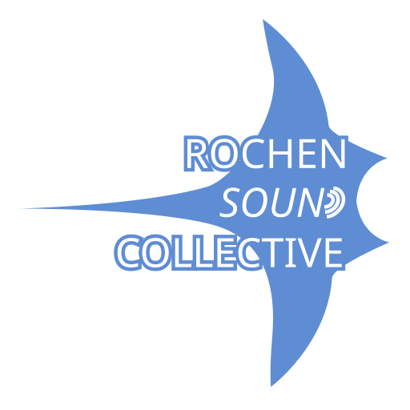

# Modular::Collection

Modular::Collection is a collection of open source audio plugins in development.

## Plugins

Right now there is only [Modular::Patterns](collection/patterns/README.md). Hopefully other plugins will follow.

### Modular::Patterns
___


A MIDI arpeggiator that combines a chord channel with a pattern. It's main difference to other plugins (I know of) it 
uses midi input for both chords and patterns. This makes it possible to use the UI of your DAW to edit you MIDI clips 
and tracks. 

[More](collection/patterns/README.md)

### Modular::Chords [planned]

A plugin for creating chord sequences.

### Modular::Transmitter/Receiver [planned]

Two plugins to allow flexible MIDI routing for DAWs where it is not supported natively. 

## Building

After installing [Rust](https://rustup.rs/), you can compile modular::collection as follows:

Modular::Patterns
```shell
cargo xtask bundle modular_patterns --release
```

