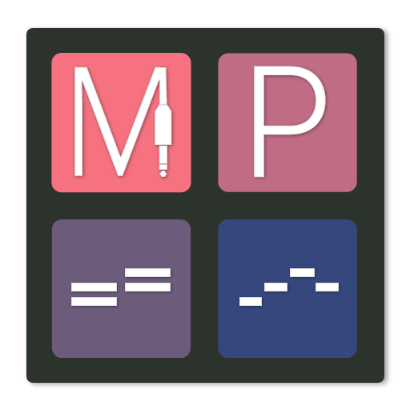
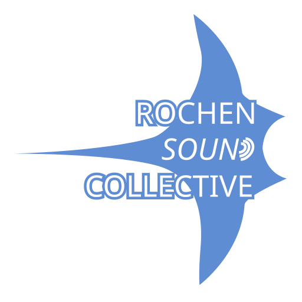
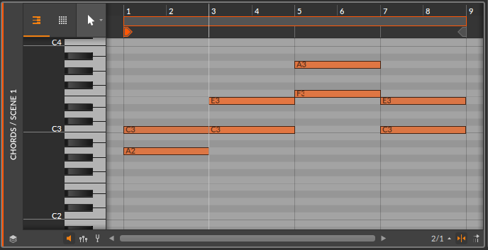
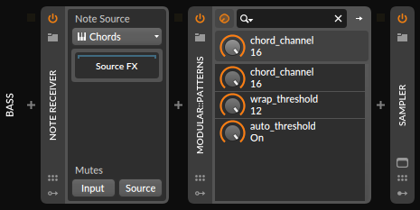
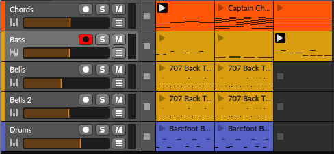
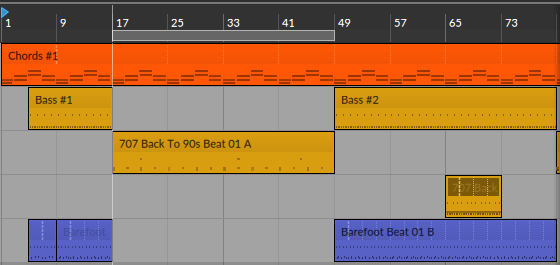

# Modular::Patterns

Modular::Patterns is a MIDI arpeggiator that combines a chord channel with a pattern. It's main difference to other 
plugins (I know of) it uses midi input for both chords and patterns. This makes it possible to use the UI of 
your DAW to edit you MIDI clips and tracks. Modular::Patterns is an audio plugin and is released in VST-3 or Clap format. 

> :warning: **Bitwig is the only supported DAW at the moment**: Please note that for now only Bitwig is supported as a DAW.
> This is because I haven't tested many other DAW's yet! Ableton Live is unfortunately incompatible so far. For details 
> please refer to [DAW Compatibility](#daw-compatibility).

## How does it work?

It kind of detaches the chords from the rhythm similar to playing a guitar. The one hand on the fretboard is holding
the chord the other hand is picking or strumming the strings forming a pattern. Modular::Patterns is similarly You can have as many pattern tracks as 
you want. This way the chord progression can be separated from the playing style. For example, you can have a bass line 
with 1/4 notes or another with syncopes playing over the same chord progression. Likewise, you can have the same bass 
line playing over different
chords.

## Getting started

**Fig. 1: Chord track with four two-note chords in a loop.**


**Fig. 2: A pattern that is applied to the chord track**

For every note the chord index is calculated, corresponding to the notes in the chord and counting from the lowest to
the highest. Since the chords have two notes the index can bei either 1 or 2. C3 is the root note with a chord index 
of 1. For the chord progression in Fig. 1 this would map to A2 for the first chord and C3 for the second.
The note C#3 would get a chord index of 2 and would map to C3 playing the first chord and E3 for the second. The next 
note D3 would have a chord index of 1 again but would play an octave higher resulting in A3 for the first chord. 
Likewise, a B2 is an octave lower which would result in the note A1.

### Setting up the DAW

#### Chord Track

As said before we use a chord track (See Fig. 1) with any chord progression we like. We can optionally add an instrument 
for the track if we want the chords to be played as is. We only need to make sure that the chord track is in a separate 
MIDI channel (By default channel 16 is assumed to be the chord channel).

#### Pattern Track

In the next step you now need to route the chord track into every pattern track. Now add the Modular::Patterns plugin to 
the track (followed by an instrument plugin to make it audible). If you chose MIDI channel 16 you are good to go, 
otherwise see the [Parameters section](#parameters).

> :hint: Depending on the DAW the approach of routing midi is very different or not possible at all. In Bitwig this can 
> be done with a note receiver device. You need select the chord track and make sure the mute options are toggled off.
> I'm hoping I can somehow improve the situation in the future. If you know of any way, please open a ticket.
 
**Fig. 3: Device setup for the pattern track in Bitwig Studio 4**


### Parameters

#### chord_channel
The channel for the chord notes. Every note on any other channel is assumed to be a pattern note.

Default: **16**

#### wrap_threshold
The amount of notes after which a chord idx is repeated and the octave increases or decreases (See Fig. 2 to understand).

Default: **12**

#### auto_threshold

When enabled the wrap_treshold is automatically adapted to the amount of notes in the chord. So with a three-note chord 
the threshold is set to three and so on. 

Default: **true**

## Things to try

**Fig. 4: Example using clips in Bitwig Studio 4**



**Fig. 5: Example using tracks in Bitwig Studio 4**



You can use any kind of input source from clips to tracks or even play live
with a MIDI controller. From there on you can start being creative. 

### Midi zones for playing patterns and chords live
You could split your MIDI keyboard into different 
zones. If you assign the chords to the chords channel you can play both chords and pattern (with one hand each) at the 
same time.


> :hint: Be experimental with MIDI clips. Remember there are no wrong notes because Modular::Patterns
> makes sure that only variants of your input chord are used. You can for example use a drum track and maybe make it 
> slower a couple of times (just like in Fig. 4) and see how that sounds. You probably also need to transpose it to 
> keep it in range of the root note C3, otherwise you might end up with too high or too low notes. 

> :hint: In case you record the chord track from a MIDI controller consider quantizing it and make sure there are no 
> gaps if you do not want the notes from the pattern track to be clipped. The pattern track does not have to be straight
> on timing. Just keep in mind that if a note is played before a chord change it is triggered for the old chord and 
> released just after that and then retriggered for the new chord. 
> 

## Installation

There is nothing special about installing Modular::Patterns. It is done like with any other plugin.
Please download the latest version from the releases page on GitHub and copy it to the Plugins folder. The correct 
location of that folder depends on your DAW. 

> Typical folders are:
> - VST-3 Windows:
>   - C:\Program Files\Common Files\VST3
>   - C:\Program Files\VstPlugins
>   - C:\Program Files (x86\VstPlugins
>   - C:\Program Files (x86)\Common Files\VST3
> - CLAP Windows:
>   - C:\Program Files\Common Files\CLAP
> - VST-3 Linux:
>   - ~/.vst3
> - CLAP Linux:
>   - ~/.clap

## DAW Compatibility
The plugin is tested with Bitwig Studio.

Unfortunately I could not convince Ableton Live to work with it, because it is not as flexible as Bitwig, when it comes 
to midi routing and defining an explicit channel for your clips. Sadly, the support for MIDI-only plug-ins in Ableton 
Live is very poor. I'm trying to find a solution to this and I will also test the plugin with other DAWs in the near future.

## OS Compatibility
The plugin is compatible with Windows and Linux. I do not own a Mac, but I do not see a reason why it should not be 
compatible with OSX, so if you are on OSX, have a look at the [building](#Building) section. Building the plugin is not 
terribly difficult. Please let me know if you are having trouble or if you were successful.

## Building

After installing [Rust](https://rustup.rs/), you can compile modular::collection as follows:

```shell
cargo xtask bundle modular_patterns --release
```
> :warning: **Bitwig Flatpak on Linux** Please note that the flatpak version of Bitwig on Linux might not be able to 
> load the plugin with an error similar to this:
> - /usr/lib/x86_64-linux-gnu/libc.so.6: version `GLIBC_2.34' not found
> 
> This is because a binary built with GLIBC of a newer version is not compatible to run with an older version of GLIBC.
> This is however contained in the Flatpak. You should update to the newest Bitwig version in this case and if there is
> no newer version you need to build with a lower version of GLIBC. The official releases are always compatible with
> the latest Flatpak.